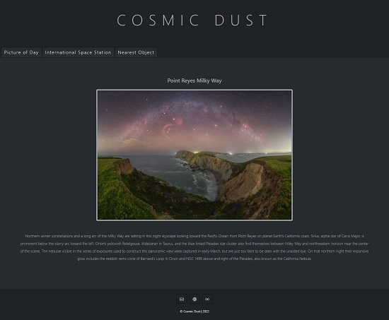

# Cosmic Dust

Space fanatics or anyone curious about space is able to view a daily picture of the day from NASA. They can also get real time data to track where the International Space Station (ISS) is and  the nearest objects (comets, asteroids) close to earth. 

Table of contents
=================
   * [Links](#links)
   * [User Guide](#user-guide)
   * [Demo](#demo)
   * [API](#api)
   * [Libraries](libraries)
   * [Authors](#authors)
   * [License](#license)
    

Links
=================     
[link to live website](https://magdalenaperry.github.io/nasa-space-things/)

[link to GitHub repository](https://github.com/magdalenaperry/nasa-space-things)

User Guide
=================

Users are encouraged to vist the website daily as the information is pulling real time data from APIs. 

1. Search

    - Search function that will take a user to Google if they are unfamiliar with any terminology or want to learn more about a topic. 

2. Picture of Day

    - Title and detailed description about the image pulled from NASA's API.

3. International Space Station (ISS)

    - When a user visits the page for the first time it will mark the current location of the ISS and save it to **local storage**. The next time the page is loaded it will connect the last location to the current location with a red line. This process is repeated until local storage is **cleared**. This allows a user to view and track the path of the ISS. The data is pulled from ISS's API. 
   
4. Nearest Objects

    - The Near-Earth-Objects are pulled from NASA's API for the current date and allows a user to see how many are orbiting close to Earth. The user can see the name, size, velocity, closest approaching time and if hazardous--color coded: green (not hazardous) , orange (potentially hazardous).
    
5. Other

    - In the footer a user can click on 3 icons: email contact and 2 APIs that were used. 

Demo
=================

https://user-images.githubusercontent.com/97912154/158078154-93080964-a595-40e2-8bed-42f8cd1e4637.mp4

API
=================
1. [NASA](https://api.nasa.gov/index.html)
    - Sign up for an API key with your email address
    - No authentication required
    - Rate limit: Hourly Limit of 1,000 requests per hour

2. [International Space Center](https://wheretheiss.at/w/developer)
    - No sign up via email required
    - No authentication required
    - Rate limit: requests are limited to roughly 1 per second

3. [Mapbox ](https://docs.mapbox.com/api/maps/static-tiles/)
    - Sign up for a Mapbox API token with your email address to use Leaflet 
    - Rate limit: 6,000 requests per minute

Libraries
================= 
1. [Leaflet](https://leafletjs.com/SlavaUkraini/)
2. [Bootstrap](https://getbootstrap.com/)
3. [Bootswatch](https://bootswatch.com/)

Authors
=================

 - Magdalena Perry: magperry16@gmail.com

 - [Rocio Galvan](https://www.linkedin.com/in/rocio-galvan/)

 License
=================

© OpenStreetMap contributors 

See more on the [Open Database License](https://www.openstreetmap.org/copyright)

      
